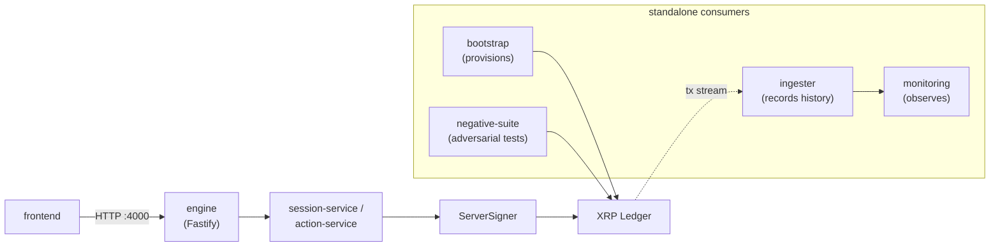

# System at a Glance

This page is a one-screen orientation to the system's shape. For the full package map, dependency
layering, and request-path detail, see [Architecture & Package Map](../03-architecture/index.md).

## Architecture



The frontend only ever speaks to the engine. Everything below the engine — session/action logic, the
signer, the ledger itself — is invisible to it. `bootstrap`, `ingester`, `negative-suite`, and
`monitoring` are separate processes that provision, record, adversarially test, and observe the same
ledger; none of them sit on the frontend's request path.

## The request-to-ledger path

A frontend calls the engine's HTTP API (port 4000) to provision a session, claim a seat, or submit an
action. The engine's session/action layer resolves the request to a concrete on-ledger transaction —
for example a `deposit` becomes a `VaultDeposit` — and signs it under the identity of the seat the
caller holds, via the `ServerSigner` seam. That transaction is submitted to the XRP Ledger like any
other client transaction. State the frontend displays — balances, vault/loan/credential state — is
read back live from the validated ledger on each request, never from a cache. The frontend never
holds a seed, a key, or a direct ledger connection; the engine and its signer are the only path to the
chain.

```
frontend → engine (HTTP :4000) → session-service / action-service → ServerSigner → XRP Ledger
```

See [the engine HTTP API](../04-api/index.md) for the full route table and error model, and
[Live State & Balances Reads](../03-architecture/state-and-balances.md) for how reads are served
without a cache.

## The eight packages

| Package | One line |
|---|---|
| `shared` | Cross-cutting utilities: config, account derivation, funding, reserves, money, the ledger client and batcher. |
| `bootstrap` | Provisioning harness — stands up a wired lending environment from one config, idempotently. |
| `session` | Turns a provisioned environment into a session of seats; bots fill unheld seats, humans claim them. |
| `engine` | Fastify HTTP service (port 4000) — provisions sessions, dispatches actions, drives bots, reports live state. |
| `ingester` | Off-chain history store — captures the transaction stream idempotently, projects current state. |
| `lifecycle` | Runs one complete loan lifecycle (deposit → originate → repay → close) against a provisioned environment. |
| `negative-suite` | Adversarial negative-test suite (N1–N15) asserting exact on-chain rejection codes. |
| `monitoring` | Prometheus + Grafana over the ingester's history store; no TypeScript source. |

This matches the package table in [Architecture & Package Map](../03-architecture/index.md) —
see that page for dependency layering and entrypoints.

## Two stores

The engine keeps an **operational** Postgres store (sessions, seat occupancy, action log); the
ingester keeps a separate **history** Postgres store (captured transactions, projected state) that
survives a ledger reset. Neither stores private keys. See
[Persistence](../03-architecture/persistence.md).

## Read next

- [Architecture & Package Map](../03-architecture/index.md) — dependency layering, entrypoints, full detail.
- [Engine HTTP API](../04-api/index.md) — routes, error model, status codes.
