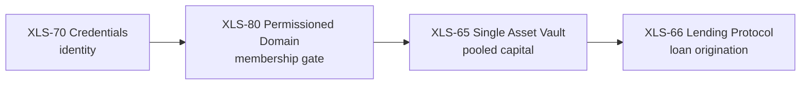

# The Amendments

This system is built entirely from five XRPL amendments. Four are chained so that each one's ledger
object becomes the next one's input — identity, gating, capital, and origination. A fifth, XLS-56
Batch, is the atomicity layer: it guarantees that the cross-account steps setting all of that up
commit together or not at all. Nothing here is enforced by application code — access control, capital
pooling, loan origination, and atomic setup are all native ledger objects and transactions, checked
by consensus. This page is the plain-language on-ramp; each section links to the detailed, cited
protocol page for that amendment, and [Protocol Foundations](../02-protocol/index.md) documents the
exact seams between them with source citations.

## The amendments, in plain language

### XLS-70 — Credentials: on-ledger identity

A credential is an attestation one account makes about another: an issuer asserts a typed claim
("this account is a verified depositor," for example) about a subject account. The credential does
nothing until the subject affirmatively accepts it — issuance and acceptance are two separate,
two-party transactions. Once accepted, the credential is a durable, native ledger object that other
protocol features can check.

Detail: [XLS-70 — Credentials](../02-protocol/xls70-credentials.md).

### XLS-80 — Permissioned Domains: a membership gate

A Permissioned Domain is a ledger object that lists which credential issuer and credential type pairs
it admits. It doesn't hold funds or users directly — it's a named admission list. Anything else that
references the domain's ID inherits that gate automatically, at the protocol level, with no
application logic evaluating "is this account a member" on the way in.

Detail: [XLS-80 — Permissioned Domains](../02-protocol/xls80-permissioned-domains.md).

### XLS-65 — Single Asset Vault: pooled capital

A vault is a pooled-liquidity object: depositors contribute one asset (XRP, an IOU, or an MPT) and
receive divisible ownership shares in return, represented as MPTokens. A vault can optionally be
created against a Permissioned Domain, in which case only accounts that clear the domain's gate may
deposit or hold shares; a vault created without a domain is open to any depositor.

Detail: [XLS-65 — Single Asset Vault](../02-protocol/xls65-single-asset-vault.md).

### XLS-66 — Lending Protocol: origination

A LoanBroker attaches to a vault and originates loans against its pooled assets. Loan origination is
bilateral: the broker's owner and the borrower must both sign the same transaction — a loan cannot be
created unilaterally. Every broker is backed by first-loss cover capital that absorbs losses before
depositors do, and the broker's owner must be the same account as the vault's owner.

Detail: [XLS-66 — Lending Protocol](../02-protocol/xls66-lending-protocol.md).

### XLS-56 — Batch: atomicity

Setting up the market means composing objects across several accounts, and two of those steps are one
unit of work spanning two accounts: a member's credential create + accept, and a holder's trust line +
the issuer's distribution. XLS-56 Batch wraps each pair in a single all-or-nothing transaction, signed
by both accounts, so either both halves apply or neither does — the market is never left
half-provisioned by a failure between the two. It is the atomicity layer beneath the four above: it
does not change *what* the market is, it guarantees *how* the market's cross-account setup commits.

Detail: [XLS-56 — Batch](../02-protocol/xls56-batch.md).

## The chain

Read top to bottom, each amendment's output becomes the next amendment's input: **on-ledger identity
gates a vault that funds a lending market.**

- **Identity → domain.** A domain names the same credential issuer and credential type that
  credentials were actually issued under, so it only admits accounts that were genuinely
  credentialed.
- **Domain → gated vault.** A vault created with that domain's ID attached becomes permissioned:
  deposits and share transfers are checked against domain membership by the ledger itself. A vault
  created without a domain is public — anyone may deposit.
- **Gated vault → lending market.** A loan broker attaches to the vault and originates loans against
  its pooled assets, backed by cover capital the broker's owner supplies. The broker and the vault
  must share one owner.

The four chained amendments define *what* the market is; XLS-56 Batch, sitting beneath them, guarantees
*how* its cross-account setup commits — atomically. For the full seam-by-seam mechanics — exact fields,
transaction order, and the negative-suite proof that the gate holds at the protocol boundary — see
[Protocol Foundations](../02-protocol/index.md).

## Read next

- [Protocol Foundations](../02-protocol/index.md) — the composition chain in full detail, cited to source.
- [XLS-70 — Credentials](../02-protocol/xls70-credentials.md)
- [XLS-80 — Permissioned Domains](../02-protocol/xls80-permissioned-domains.md)
- [XLS-65 — Single Asset Vault](../02-protocol/xls65-single-asset-vault.md)
- [XLS-66 — Lending Protocol](../02-protocol/xls66-lending-protocol.md)
- [XLS-56 — Batch](../02-protocol/xls56-batch.md)
