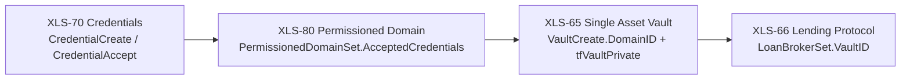

# How the Four Amendments Compose

The platform's thesis: **on-ledger identity gates a vault that funds a lending market.** Four XRPL
amendments are chained so that each one's output is the next one's input — access policy is enforced
by consensus, not by application code sitting in front of it.

- **XLS-70 Credentials** — identity: an issuer attests a typed credential to a subject.
- **XLS-80 Permissioned Domains** — enforcement: a domain lists which credential issuer/type pairs it
  admits.
- **XLS-65 Single Asset Vault** — capital: a vault holds pooled liquidity and mints shares, gated to
  domain members when the domain is attached.
- **XLS-66 Lending Protocol** — origination: a loan broker attached to the vault originates loans
  against the pooled liquidity, backed by first-loss cover.

Each amendment is documented in full on its own page (linked at the end). This page documents only
the seams — the concrete points where one amendment's object or field becomes another's input — each
cited to the reference implementation (`lending-reference`, package `bootstrap`, `src/steps.ts` /
`src/provision.ts` / `src/assertions.ts` unless noted).

## The chain



## The five composition points

### 1. Credentials → Domain

`PermissionedDomainSet.AcceptedCredentials` lists the same issuer address and credential type that
`CredentialCreate` grants to members, so the domain only admits members the credential issuer has
actually credentialed.

`createDomain` builds the domain from the same two values `credentialCreateSteps` used:

```ts
// steps.ts:154-167
export async function createDomain(deps: StepDeps): Promise<void> {
  const owner = deps.accounts.owner.wallet;
  // The domain accepts credentials from the credential issuer (not the currency issuer), matching what
  // issueCredentials grants.
  const issuer = requireCredentialIssuer(deps);
  const credHex = encodeCredentialType(requireCredentialType(deps));

  await runBatch(deps, [{
    action: "domain-create",
    alreadyDone: async () => (await findDomainId(deps.client, owner.address)) !== undefined,
    build: () => ({ wallet: owner, tx: { TransactionType: "PermissionedDomainSet", Account: owner.address, AcceptedCredentials: [{ Credential: { Issuer: issuer.address, CredentialType: credHex } }] } }),
  }]);
  deps.env.objects.domainId = await findDomainId(deps.client, owner.address);
}
```

`requireCredentialIssuer` and `requireCredentialType` (`steps.ts:127-132`, `steps.ts:120-125`) pull
the exact `issuer` and `credHex` that `credentialCreateSteps` (`steps.ts:134-142`) used to grant each
member's credential — the domain is built from the same identity the credentials were issued under,
not a second, independently-configured one.

> [!NOTE]
> The domain admits the **credential issuer**, a distinct derived account from the **currency
> issuer** that mints the vault's IOU (design point in `.docsource/amendment-map.md`, "Credential-issuer
> vs currency-issuer split"). Conflating the two is a common modeling mistake this implementation
> avoids by deriving separate accounts (`accounts.ts:8`, cited on the [Credentials](./xls70-credentials.md)
> page).

### 2. Domain → Vault

The domain's identifier is pinned into the vault at creation, together with the `tfVaultPrivate`
flag — this is the protocol-level commitment that makes vault deposits domain-gated.

```ts
// steps.ts:169-193
export async function createVault(deps: StepDeps): Promise<void> {
  const owner = deps.accounts.owner.wallet;
  // A permissioned vault has a domain (created just before this) and is private + domain-gated. A public
  // vault has no domain: it is created open, so anyone may deposit without a credential.
  const domainId = deps.env.objects.domainId;
  const permissioned = domainId !== undefined;

  const asset: Currency = isXrpAsset(deps.config.asset)
    ? { currency: "XRP" }
    : { currency: deps.config.asset.currency, issuer: deps.accounts.issuer.address };

  await runBatch(deps, [{
    action: "vault-create",
    alreadyDone: async () => (await findVault(deps.client, owner.address)) !== undefined,
    build: () => ({
      wallet: owner,
      tx: {
        TransactionType: "VaultCreate",
        Account: owner.address,
        Asset: asset,
        ...(permissioned ? { DomainID: domainId, Flags: VaultCreateFlags.tfVaultPrivate } : {}),
        WithdrawalPolicy: VaultWithdrawalPolicy.vaultStrategyFirstComeFirstServe,
      },
    }),
  }]);
  const vault = await findVault(deps.client, owner.address);
  deps.env.objects.vaultId = vault?.index;
  deps.env.objects.shareMptId = vault?.shareMptId;
}
```

The presence of `domainId` (`steps.ts:173-174`) is the **sole** permissioned/public switch: when a
domain was created in step 1, the vault is built `private` and pinned to that domain (`steps.ts:189`);
when there is no domain (public-vault configuration), the vault is created with neither field, and
any account may deposit without a credential. The reference implementation's negative suite proves
the gate at the protocol boundary: an uncredentialed deposit against a permissioned vault returns
`tecNO_AUTH` (case N1), while the same deposit against a public vault returns `tesSUCCESS` (case P1) —
see `.docsource/amendment-map.md` XLS-65 section and the [transaction map](../07-reference/transaction-map.md).

### 3. Vault → Lending

`LoanBrokerSet.VaultID` attaches the broker to the vault, and the two objects are required to share
one owner — an invariant the implementation asserts on-ledger immediately after both exist, rather
than only at construction time.

```ts
// steps.ts:199-222
export async function createBroker(deps: StepDeps): Promise<void> {
  const owner = deps.accounts.owner.wallet;
  const vaultId = deps.env.objects.vaultId;
  if (!vaultId) throw new Error("cannot create a broker before the vault exists");

  await runBatch(deps, [{
    action: "broker-create",
    alreadyDone: async () => (await findBrokerId(deps.client, owner.address)) !== undefined,
    build: () => ({
      wallet: owner,
      tx: {
        TransactionType: "LoanBrokerSet",
        Account: owner.address,
        VaultID: vaultId,
        ManagementFeeRate: deps.config.managementFeeRate,
        // DebtMaximum is in the broker's asset units — drops for XRP, whole tokens otherwise.
        DebtMaximum: isXrpAsset(deps.config.asset) ? xrpToDrops(deps.config.debtMaximum) : deps.config.debtMaximum,
        CoverRateMinimum: deps.config.coverRateMinimum,
        CoverRateLiquidation: deps.config.coverRateLiquidation,
      },
    }),
  }]);
  deps.env.objects.brokerId = await findBrokerId(deps.client, owner.address);
}
```

`createBroker` refuses to run before a vault exists (`steps.ts:202`). Once both objects are on ledger,
`provision` calls `assertSingleOwner` before cover is ever deposited:

```ts
// assertions.ts:13-26
export async function assertSingleOwner(client: Client, owner: string): Promise<void> {
  const vaults = await accountObjects(client, owner, "vault");
  const brokers = await accountObjects(client, owner, "loan_broker");
  const vault = vaults[0];
  const broker = brokers[0];
  if (!vault) throw new InvariantError("no vault found under the owner account");
  if (!broker) throw new InvariantError("no loan broker found under the owner account");

  const vaultOwner = (vault.Owner as string | undefined) ?? owner;
  const brokerOwner = (broker.Owner as string | undefined) ?? owner;
  if (brokerOwner !== vaultOwner) {
    throw new InvariantError(`broker owner ${brokerOwner} does not match vault owner ${vaultOwner}`);
  }
}
```

Called at `provision.ts:117`, right after `createBroker` (`provision.ts:114`) and before
`depositCover` (`provision.ts:119`). Loan principal is subsequently drawn from the vault's available
assets and bounded by the broker's cover — the [Lending Protocol](./xls66-lending-protocol.md) page
documents the cover-rate math (`bots/reads.ts:148-167` per the code map).

### 4. Provisioning order encodes the chain

`provision` runs the four amendments' setup transactions in a fixed sequence, and each stage is
gated on the config that would make the next stage meaningful:

```ts
// provision.ts:106-114
// Credentials and the domain are only provisioned for a permissioned vault. A public vault skips
// both — no credential is issued, no domain is created — so createVault below makes an open vault.
if (config.domain) {
  await runBatch(deps, credentialCreateSteps(deps));
  await runBatch(deps, credentialAcceptSteps(deps));
  await createDomain(deps);
}
await createVault(deps);
await createBroker(deps);
```

Order: issuer flags and asset distribution for an issued asset (`provision.ts:92-104`, skipped for a
native-XRP vault) → credential issuance and acceptance, then domain creation, only if `config.domain`
is set (`provision.ts:108-112`) → vault creation, always (`provision.ts:113`) → broker creation, always
(`provision.ts:114`) → single-owner assertion (`provision.ts:117`) → cover deposit and its minimum-cover
assertion (`provision.ts:119-120`). The sequence is not incidental: `createVault` reads
`deps.env.objects.domainId` to decide whether to build a private, pinned vault (`steps.ts:173-174`), so
it must run after `createDomain` populates that field (`steps.ts:166`); `createBroker` reads
`deps.env.objects.vaultId` and throws if it is unset (`steps.ts:201-202`), so it must run after
`createVault` populates that field (`steps.ts:195`).

> [!NOTE]
> `runBatch` is an idempotency wrapper, not a protocol concept: each step checks `alreadyDone()`
> against the live ledger before building a transaction, so re-running `provision` against an
> existing environment skips objects that already exist rather than re-submitting them
> (`steps.ts:52-78`). This is implementation behavior, not something the amendments require.

### 5. State projection reads all four object families

Once provisioned, the running session's state is a live read of all four amendments' ledger objects
in one call — the vault, the broker, each borrower's loans, and (for a permissioned session) each
member's credential status:

```ts
// state-service.ts:37-47 (opening) and :93-104 (return)
export async function readSessionState(session: Session): Promise<SessionState> {
  ...
  const owner = session.env.accounts.owner.address;
  const vault = await firstObject(session, owner, "vault");
  const broker = await firstObject(session, owner, "loan_broker");
  ...
  return {
    setupId: session.setupId,
    vault: vault ? { assetsTotal: ..., assetsAvailable: ..., ...(session.env.objects.shareMptId ? { shareMptId: ... } : {}) } : null,
    broker: broker ? { coverAvailable: assetValue(broker.CoverAvailable) } : null,
    loans,
    seats: [...],
    credentials,
  };
}
```

Credential status is read per member and judged against the **credential issuer**, not the currency
issuer (`state-service.ts:78-90`) — the same distinction enforced at domain-creation time in
composition point 1. For a public (non-permissioned) session the credential list is empty and no
per-account lookup runs at all (`state-service.ts:80`), because there is no domain to be a member of.

## Read next

- [XLS-65 — Single Asset Vault](./xls65-single-asset-vault.md)
- [XLS-66 — Lending Protocol](./xls66-lending-protocol.md)
- [XLS-70 — Credentials](./xls70-credentials.md)
- [XLS-80 — Permissioned Domains](./xls80-permissioned-domains.md)
