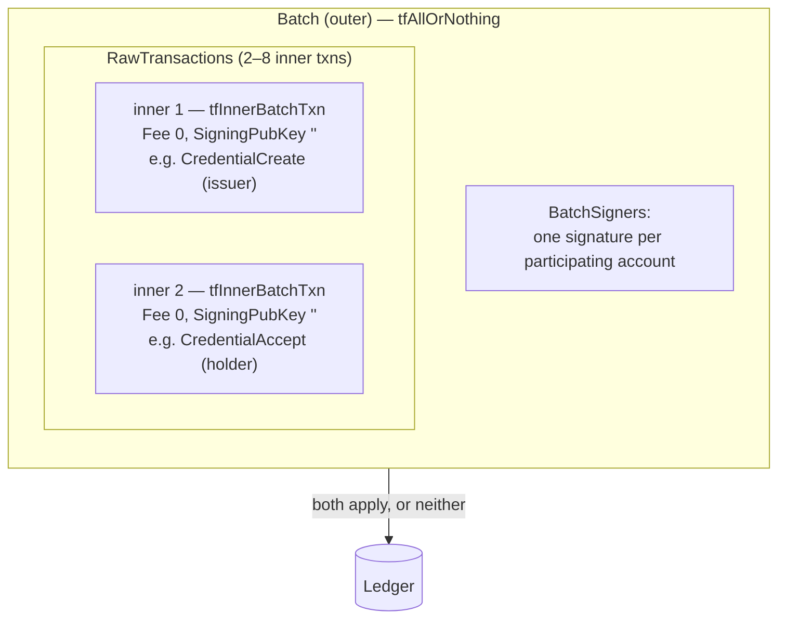

# XLS-56 — Batch

XLS-56 gives the ledger native **atomic multi-account transactions**: several transactions, potentially
signed by different accounts, wrapped in one outer `Batch` that either applies in full or not at all.
It is the **atomicity layer** of this system — the amendment that lets the other four be stood up
correctly. Where [Credentials (XLS-70)](./xls70-credentials.md), [Permissioned Domains
(XLS-80)](./xls80-permissioned-domains.md), the [Single Asset Vault (XLS-65)](./xls65-single-asset-vault.md)
and the [Lending Protocol (XLS-66)](./xls66-lending-protocol.md) define *what* the market is, XLS-56
governs *how* its cross-account setup steps commit: together, or not at all.

This page documents the `Batch` transaction and the two provisioning pairs it makes atomic. For the
engine-side mechanics — the `submitNativeBatch` primitive, chunking, and idempotency — see
[Transaction Batching](../03-architecture/transaction-batching.md#6-native-xls-56-batch--atomic-cross-account-pairs).

## Why atomicity matters here

Provisioning a permissioned lending market means composing objects across several accounts. Two of
those steps are genuinely *one unit of work spanning two accounts*, and each has an ordering hazard if
submitted as separate transactions:

- **The credential handshake.** The credential issuer creates a credential (`CredentialCreate`) and the
  subject accepts it (`CredentialAccept`). The accept depends on the create; a create that lands
  without its accept leaves a member half-credentialed and unable to join the gated vault.
- **Trust line and distribution.** A holder establishes a trust line (`TrustSet`) and the issuer
  distributes the asset into it (`Payment`). The distribution depends on the trust line existing; a
  trust line without its distribution leaves a holder with no balance to deposit.

Without atomicity, a failure between the two halves leaves the environment in a partially-provisioned
state that a human then has to diagnose and repair. XLS-56 removes the hazard: each pair is one
`Batch`, so the ledger applies both inner transactions or neither.

## The Batch transaction

A `Batch` carries:

- **`RawTransactions`** — 2 to 8 inner transactions. Each inner carries the `tfInnerBatchTxn` flag, a
  `Fee` of `0`, and an empty `SigningPubKey`; it is *not* signed individually. The outer transaction
  pays the whole fee.
- **`BatchSigners`** — one entry per distinct account that owns an inner transaction, so a batch
  spanning two accounts is authorized by both. Each account signs over the batch's flags and the
  hashes of its inner transactions.
- **A mode flag.** This system always uses **`tfAllOrNothing`**: every inner transaction must succeed
  for any to apply. (The amendment also defines `tfOnlyOne`, `tfUntilFailure`, and `tfIndependent`,
  which relax that guarantee; provisioning wants strict all-or-nothing.)

The result is a single validated transaction on-ledger whose metadata records the outcome of every
inner transaction — one atomic unit, one fate.

## What is, and is not, batched

| Provisioning step | Accounts | Batched? |
|---|---|---|
| Credential create + accept | credential issuer + holder | **Yes** — one `tfAllOrNothing` `Batch` per holder |
| Trust line + distribution | holder + currency issuer | **Yes** — one `tfAllOrNothing` `Batch` per holder |
| Issuer flags (clawback, default-ripple) | issuer only | No — single account, no cross-account atomicity to gain |
| Vault → broker → cover | owner only | No — each step needs a ledger-object ID the previous one creates, which an inner transaction cannot reference |

A **public** vault has no credentials and a **native-XRP** vault has no trust lines or distributions,
so those paths engage no cross-account batches at all — XLS-56 is used precisely where an atomic
cross-account pair genuinely exists.

## Network requirement

XLS-56 Batch requires the **`BatchV1_1`** amendment, active on Devnet, and an `xrpl` client that
implements its signing preimage. See [Running the Engine](../05-guides/running-the-engine.md) and
[Environment Variables](../07-reference/environment-variables.md) for the client version this pins.

## Read next

- [Transaction Batching](../03-architecture/transaction-batching.md) — the `submitNativeBatch`
  primitive and how provisioning routes each pair to it, cited to source.
- [Protocol Foundations](./index.md) — how all the amendments compose into one market.
- [The Amendments](../01-overview/the-four-amendments.md) — the plain-language overview.
