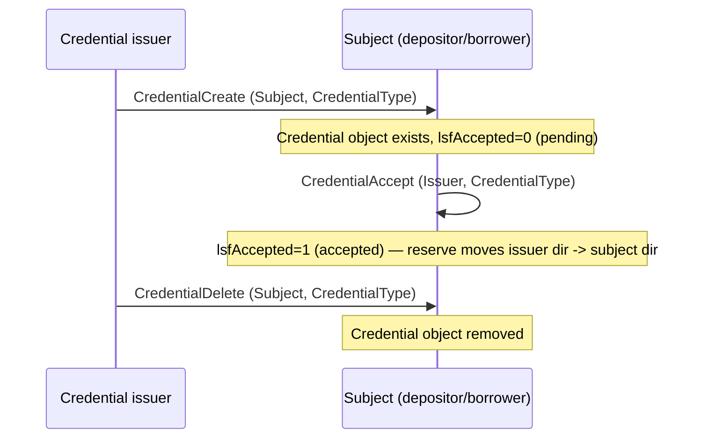

# XLS-70 — Credentials

XLS-70 gives the ledger a native, typed attestation object: one account (an issuer) asserts a typed
claim about another account (a subject), and the subject must affirmatively accept it before it takes
effect. In this system, credentials are the identity primitive that [Permissioned Domains
(XLS-80)](./xls80-permissioned-domains.md) reads to decide who may join a gated vault — see [how the
four amendments compose](./index.md) for the full chain. This page documents the credential lifecycle
in isolation: issue, accept, revoke, and the ledger object those transactions produce.

## The lifecycle



A credential is inert until the subject accepts it — a `CredentialCreate` alone does not grant
membership in anything gated on it. Our own state read reflects this three-way status explicitly
(`status: "accepted" | "pending" | "none"`, `state-service.ts:87`).

## Transactions

| Transaction | Signer | Fields we set | Effect | Source |
|---|---|---|---|---|
| `CredentialCreate` | Credential issuer | `Subject`, `CredentialType` (hex) | Creates a pending `Credential` object naming the subject; inert until accepted. | `steps.ts:140` (provisioning), `action-service.ts:104-110` (action `issue-credential`) |
| `CredentialAccept` | Subject | `Issuer`, `CredentialType` (hex) | Sets `lsfAccepted` on the credential the named issuer created for this subject. Second half of a two-party handshake — the subject, not the issuer, submits this transaction. | `steps.ts:150` (provisioning), `action-service.ts:123-129` (action `accept-credential`) |
| `CredentialDelete` | Credential issuer | `Subject`, `CredentialType` (hex) | Removes the `Credential` object, accepted or not. | `teardown.ts:79` (teardown), `action-service.ts:112-118` (action `revoke-credential`) |

`CredentialType` is submitted to the ledger as hex, encoded from a readable ASCII string in our
config/params:

```ts
// ledger-lookups.ts:8-10
export function encodeCredentialType(type: string): string {
  return Buffer.from(type, "utf8").toString("hex").toUpperCase();
}
```

Both `credentialCreateSteps` and `credentialAcceptSteps` (`steps.ts:134-152`) iterate the same member
list — every depositor and every borrower — and encode the same credential type, so the type minted
at issuance is exactly the type the subject later accepts:

```ts
// steps.ts:134-152
export function credentialCreateSteps(deps: StepDeps): PlannedStep[] {
  const issuer = requireCredentialIssuer(deps);
  const credHex = encodeCredentialType(requireCredentialType(deps));
  return [...deps.accounts.depositors, ...deps.accounts.borrowers].map((member) => ({
    action: `credential-create-${member.role}[${member.index}]`,
    alreadyDone: () => hasAcceptedCredential(deps.client, member.wallet.address, issuer.address, credHex),
    build: () => ({ wallet: issuer, tx: { TransactionType: "CredentialCreate", Account: issuer.address, Subject: member.wallet.address, CredentialType: credHex } }),
  }));
}

export function credentialAcceptSteps(deps: StepDeps): PlannedStep[] {
  const issuer = requireCredentialIssuer(deps);
  const credHex = encodeCredentialType(requireCredentialType(deps));
  return [...deps.accounts.depositors, ...deps.accounts.borrowers].map((member) => ({
    action: `credential-accept-${member.role}[${member.index}]`,
    alreadyDone: () => hasAcceptedCredential(deps.client, member.wallet.address, issuer.address, credHex),
    build: () => ({ wallet: member.wallet, tx: { TransactionType: "CredentialAccept", Account: member.wallet.address, Issuer: issuer.address, CredentialType: credHex } }),
  }));
}
```

Provisioning runs every `credentialCreateSteps` step, then every `credentialAcceptSteps` step, only
when the session config declares a domain (permissioned vault) — a public vault issues no credentials
at all. Each step is idempotent: `alreadyDone` checks `hasAcceptedCredential` against the live ledger
before submitting, so re-running provisioning against an existing environment does not resubmit
settled credentials.

## The Credential ledger object

Read via `account_objects` with `type: "credential"` (`ledger-lookups.ts:48`, `state-service.ts:82`).

| Field | Meaning | Where we read/write it |
|---|---|---|
| `Issuer` | The account that created the credential. | Matched against our derived credential issuer in `hasAcceptedCredential` (`ledger-lookups.ts:51`) and in state reads (`state-service.ts:84`). |
| `Subject` | The account the credential is about. | Matched in `hasAcceptedCredential` (`ledger-lookups.ts:52`) and state reads (`state-service.ts:84`). |
| `CredentialType` | The hex-encoded type. | Matched in `hasAcceptedCredential` (`ledger-lookups.ts:53`). |
| `Flags` | Bitfield; carries `lsfAccepted`. | Read in `isAccepted` (`ledger-lookups.ts:60-63`) and `state-service.ts:87`. |

**`lsfAccepted = 0x00010000` (65536).** Per the xrpl.org Credential ledger-entry reference and
XLS-70, this flag means the subject has accepted the credential; it is off by default and is enabled
by a successful `CredentialAccept`. Accepting also shifts the reserve burden for the object from the
issuer's owner directory to the subject's owner directory. Our code hardcodes the identical bit value
in two places:

```ts
// ledger-lookups.ts:60-63
function isAccepted(credential: Record<string, unknown>): boolean {
  const flags = typeof credential.Flags === "number" ? credential.Flags : 0;
  const LSF_ACCEPTED = 0x00010000;
  return (flags & LSF_ACCEPTED) !== 0;
}
```

```ts
// state-service.ts:30-31
const LSF_LOAN_DEFAULTED = 0x00010000;
const LSF_CREDENTIAL_ACCEPTED = 0x00010000;
```

`state-service.ts` derives a three-way status per member from the same bit (`state-service.ts:85-89`):
no matching `Credential` object at all is `"none"`; a matching object with the bit clear is
`"pending"`; a matching object with the bit set is `"accepted"` (`state-service.ts:87`). This status
list drives the front end's view of who still needs to accept an issued credential.

> [!NOTE]
> `LSF_LOAN_DEFAULTED` on the `Loan` object happens to share the same bit value (`0x00010000`) as
> `lsfAccepted` on `Credential`. They are unrelated flags on unrelated object types — the shared
> numeric value is a coincidence of each object's own flag layout, not a shared meaning.

## Design point: membership is judged against the credential issuer, not the currency issuer

This system derives two distinct accounts by role: `issuer` mints the vault's currency (IOU flags,
trust lines, distribution); `credentialIssuer` is a separate derived account that issues domain
credentials (`Role` enum, `accounts.ts:8`; `credentialIssuer` derived only for a permissioned session,
`accounts.ts:35-36,55`). Every credential-membership check in this codebase — provisioning's
idempotency check, the domain's `AcceptedCredentials`, and the live state read — is matched against
`credentialIssuer`, never against the currency `issuer`:

```ts
// state-service.ts:77-84
// Credentials are issued by the credential issuer (present only for a permissioned session), so
// membership is judged against that account, not the currency issuer.
const credentialIssuer = session.env.accounts.credentialIssuer?.address;
const credentials: SessionState["credentials"] = [];
const subjects = isPermissioned(session.env) && credentialIssuer ? [...session.env.accounts.depositors, ...session.env.accounts.borrowers] : [];
for (const acct of subjects) {
  const res = await session.client.request({ command: "account_objects", account: acct.address, type: "credential", ledger_index: "validated" });
  const creds = res.result.account_objects as unknown as Record<string, unknown>[];
  const mine = creds.find((c) => c.Issuer === credentialIssuer && c.Subject === acct.address);
```

This keeps the raw ledger legible: currency movement and identity attestation are never signed by the
same account. Full detail on why the two accounts are kept separate, and how the domain object
consumes the credential issuer's address, lives on the [Permissioned Domains
page](./xls80-permissioned-domains.md) and in [how the four amendments compose](./index.md).

## Gating boundaries the negative suite proves

The reference implementation's negative suite (`packages/negative-suite/src/cases/credentials.ts`)
exercises five ways a `VaultDeposit` is rejected at the domain gate, plus one share-transfer case —
all `tecNO_AUTH`:

| Case | Scenario | Source |
|---|---|---|
| N1 | Account holds no credential at all. | `credentials.ts:20-31` |
| N2 | Account holds an accepted credential of the wrong type. | `credentials.ts:33-45` |
| N3 | Account holds the right credential type, but issued by an unrecognized ("rogue") issuer not listed in the domain. | `credentials.ts:47-63` |
| N4 | A legitimate member's credential is revoked (`CredentialDelete`) before the deposit attempt. | `credentials.ts:65-81` |
| N5 | A vault share (share-MPT) is transferred toward a non-member account. | `credentials.ts:83-101` |

Every one of N1–N5 asserts `tecNO_AUTH`; see [Result Codes](../07-reference/result-codes.md) for the
full `tecNO_AUTH` entry and citations, and [the negative suite](../06-security/negative-suite.md) for
the complete adversarial case list. The suite's `P1` case is the direct counterpart to N1 on a public
(non-permissioned) vault: the identical uncredentialed deposit returns `tesSUCCESS`, because a public
vault has no domain and therefore no gate to fail.

## Read next

- [Result Codes](../07-reference/result-codes.md) — `tecNO_AUTH` and the full ledger/HTTP code reference.
- [Transaction Map](../07-reference/transaction-map.md) — every transaction this system submits, by amendment.
- [Permissioned Domains (XLS-80)](./xls80-permissioned-domains.md) — how `AcceptedCredentials` consumes what this page issues.
- [How the Four Amendments Compose](./index.md) — the full credential → domain → vault → lending chain.
