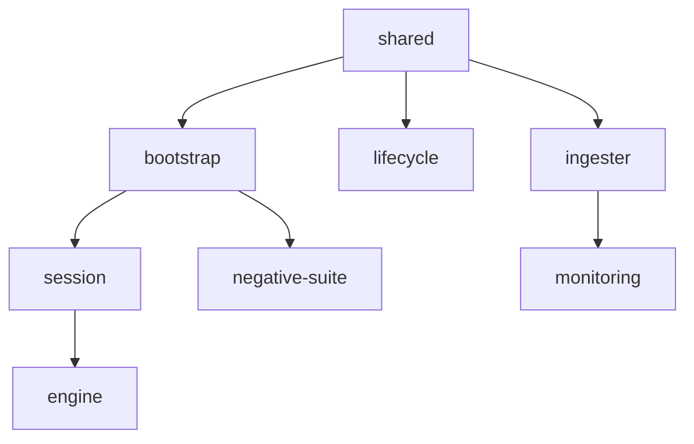

# Architecture & Package Map

The reference implementation is a pnpm workspace of eight packages. Four form a dependency chain from
low-level utilities up to the HTTP service; four more are standalone consumers that drive, observe, or
adversarially test a provisioned environment.

> [!NOTE]
> The repository root `README.md` layout block predates most of these packages and lists only
> `shared` and `bootstrap`. This page is the current package map and supersedes it.

## The eight packages

| Package | Responsibility | Entrypoint |
|---|---|---|
| `shared` | Cross-cutting utilities: config load/validation, deterministic account derivation, treasury funding, per-role reserve sizing, integer money, the ledger client and the per-ledger batcher (`submitBatch`). | library (`src/index.ts`) |
| `bootstrap` | Provisioning harness — stands up a fully-wired permissioned (or public) lending environment from one config, idempotently, and tears it down. | `src/cli.ts` |
| `session` | Turns a provisioned environment into a session whose roles are seats; bots fill unheld seats, humans claim to act. | `src/cli.ts` |
| `engine` | Fastify HTTP service (port 4000) over the session engine — provisions sessions, claim/release seats, dispatches per-role actions to the ledger, drives bots, reports live state. | `src/main.ts` |
| `ingester` | Off-chain history store — subscribes to the transaction stream, captures idempotently (keyed on tx hash), normalizes to typed events, and projects current state. The durable record when a Devnet reset wipes the chain. | `src/cli.ts` |
| `lifecycle` | Runs one complete loan lifecycle (deposit → bilateral origination → repayment → close) against a provisioned environment, observable on Devnet. | `src/cli.ts` |
| `negative-suite` | Adversarial negative-test suite (N1–N15) asserting the exact engine rejection codes observed on-chain. | `src/cli.ts` |
| `monitoring` | Self-contained Prometheus + Grafana stack over the ingester history store via `postgres_exporter`. No TypeScript source — a `docker-compose` stack plus `queries.yaml` and Grafana dashboards. | `docker compose up` |

## Dependency layering

`shared` is the base; `bootstrap` builds on it; `session` builds on `bootstrap`; `engine` builds on
`session`. The other four packages consume `shared` and `bootstrap` directly and run on their own.



## The request-to-ledger path

A front end never touches the ledger. It speaks HTTP to the `engine`; the engine translates a request
into an on-ledger transaction, signs it under the acting seat's identity, and submits it:

```
frontend → engine (HTTP :4000) → session-service / action-service → ServerSigner → XRP Ledger
```

Each seat is bound to a deterministically derived account (see [Account Derivation](./account-derivation.md)),
and every action is authorized against the seat that holds it before it reaches the ledger. State the
front end displays is read back live from the validated ledger, not from a cache (see
[Live State & Balances Reads](./state-and-balances.md)).

## Two independent stores

The engine keeps an **operational** Postgres store (sessions, seat occupancy, action log); the ingester
keeps a separate **history** store (captured transactions, projected state) that survives ledger resets.
Neither stores private keys — accounts are re-derived from a seed and a per-session token. See
[Persistence](./persistence.md).

## Read next

- [Provisioning Sequence](./provisioning-sequence.md) — the exact on-ledger object-creation order.
- [Per-Ledger Transaction Batching](./transaction-batching.md) — how many transactions reach one ledger.
- [The Session & Seat Model](./session-seat-model.md) — seats, occupancy, and the signer seam.
- [How the Amendments Compose](../02-protocol/index.md) — the protocol foundations.
