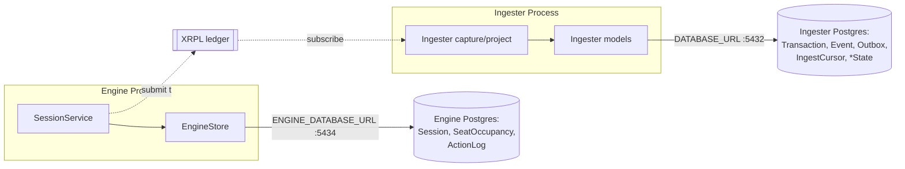

# Persistence

The system has two independent Postgres stores, owned by two different packages, for two different purposes:

| Store | Package | Env var | Default port | Purpose |
|---|---|---|---|---|
| Operational store | `engine` | `ENGINE_DATABASE_URL` | 5434 | What sessions exist, who holds each seat, what actions were taken |
| History store | `ingester` | `DATABASE_URL` | 5432 | Durable record of every on-chain transaction/event, and projected current state |

They are deliberately separate databases, not separate schemas in one database. The engine's `docker-compose` runs its Postgres on host port 5434 specifically so it never collides with the ingester's default 5432 (`packages/engine/docker-compose.yml`, comment block). Each generates its own Prisma client from its own schema — the engine's client is generated into `packages/engine/src/generated/prisma` rather than the shared default location, precisely so the two schemas never merge into one client (`packages/engine/prisma/schema.prisma:1-3`).

The reason for the split is what each store is *for*: the engine's store is live operational state for a running service (it can be wiped and rebuilt by re-provisioning); the ingester's store is the durable history of what actually happened on-ledger, which must outlive both the engine process and any given Devnet chain. Coupling them would mean an engine restart or resize could put the history record at risk, and vice versa.

> [!NOTE]
> Both connection strings are required, not optional. The engine's constructor throws immediately if `ENGINE_DATABASE_URL` is unset (`store.ts:37-39`), and `EngineStore.connect()` runs a `SELECT 1` at boot before the app accepts any traffic (`store.ts:45-47`, wired from `app.ts:24-25`) — the engine fails fast rather than serving requests it cannot durably record.

## Engine store — operational state

Source: `packages/engine/src/store.ts` (`EngineStore` class) and `packages/engine/prisma/schema.prisma`.

Three models, one Prisma client:

| Model | Key | Fields | Purpose |
|---|---|---|---|
| `Session` | `setupId` (PK) | `token`, `network`, `label?`, `createdAt`, `vaultId?`, `brokerId?`, `domainId?`, `shareMptId?`, `env` (Json) | One provisioned session |
| `SeatOccupancy` | `(setupId, seatKey)` (PK) | `kind` (`open`\|`bot`\|`human`), `participant?` | Who currently holds a seat |
| `ActionLog` | `id` (cuid, PK) | `setupId`, `seq` (Int), `ts`, `actor`, `role`, `by` (`human`\|`bot`\|`system`), `action`, `code`, `hash?`, `params?` (Json) | Append-only record of every action and its ledger result |

(`schema.prisma:23-71`)

**Session.** `env` holds the full `ProvisionedEnvironment` as JSON — account addresses, object ids, provisioning steps — everything needed to reconstruct the live session handle. `vaultId`/`brokerId`/`domainId`/`shareMptId` are denormalized copies of ids that also live inside `env`, presumably for direct querying (`schema.prisma:23-37`).

**SeatOccupancy.** Replaces what the schema comment calls a "JSON occupancy sidecar" — occupancy is written through on every claim/release so it survives a restart and is queried from the same store as everything else (`schema.prisma:39-40`). `EngineStore.saveOccupancy` and `createOccupancy` write it; `loadOccupancy` reconstructs an `Occupant` value (`open`/`bot`/`{kind: "human", id}`) per seat (`store.ts:84-92, 100-109, 189-200`).

**ActionLog.** `seq` is assigned by `EngineStore.appendAction` as `(current max seq for the session) + 1`, computed with a `findFirst … orderBy seq desc` immediately before the insert (`store.ts:113-132`) — so ordering is stable per session regardless of concurrent writers. `params` is stored raw (`Json?`) so formatting into a human-readable detail happens client-side at render time, not at write time (`schema.prisma:66`, comment).

**Genesis log entries.** Provisioning itself — funding, credential issuance, vault/broker creation, cover deposit — is recorded as the first entries in a session's action log, attributed to actor/role `"system"` since provisioning is not a seat action. `SessionService.create` calls `store.saveProvisioningSteps` right after `store.saveSession`, so these steps occupy `seq` 1..N before any human or bot action is possible (`store.ts:134-155`; `session-service.ts:115-120`).

**Table:**

```ts
// store.ts:138-155
async saveProvisioningSteps(
  setupId: string,
  steps: { action: string; result: string; txHash?: string }[],
): Promise<void> {
  if (steps.length === 0) return;
  await this.db.actionLog.createMany({
    data: steps.map((s, i) => ({
      setupId,
      seq: i + 1,
      actor: "system",
      role: "system",
      by: "system",
      action: s.action,
      code: s.result,
      hash: s.txHash ?? null,
    })),
  });
}
```

`EngineStore.saveSession` writes a session and its initial (all-bot) occupancy in a single Prisma `$transaction` (`store.ts:54-81`), so a session never exists in the store without its seats accounted for.

### No private keys are ever stored

This is a load-bearing property of the design, not an incidental one: **the engine's database contains no private key, ever.**

What is persisted per session is the derivation `token` (a short per-session string) and the public `env` (addresses and object ids). Wallets are never serialized to the store. On boot, `SessionService.loadPersisted` reloads every stored session, recombines the base config seed with the stored `token` into the same seed string used at provisioning (`` `${baseConfig.seed}-${s.token}` ``), and re-attaches the session — which re-derives every account's wallet from that seed via `deriveAccount` — before restoring who held each seat:

```ts
// session-service.ts:164-177
async loadPersisted(): Promise<number> {
  const stored = await this.store.loadAllSessions();
  for (const s of stored) {
    const seed = `${this.baseConfig.seed}-${s.token}`;
    const session = await this.registry.attachFrom(s.env, seed);
    this.tokens.set(s.setupId, s.token);
    const occupancy = await this.store.loadOccupancy(s.setupId);
    for (const o of occupancy) {
      const seat = session.seats.get(o.seatKey);
      if (seat) seat.occupant = o.occupant;
    }
  }
  return stored.length;
}
```

The schema's own header comment states this explicitly: "No secrets are stored. A session persists its derivation token and its public environment (account addresses and object ids); wallets are re-derived from the configured seed and the token at load, so the database never holds a private key." (`schema.prisma:1-7`; identical statement in `store.ts:5-8`.)

Practically: a compromise of the engine's Postgres instance exposes session metadata (which addresses exist, what actions were taken, at what seats) but not signing capability. Signing capability requires both the stored `token` *and* the base seed — the latter is an engine process env var (`ENGINE_SEED`, per `code-map.md` engine config), never written to this store. See [Deterministic Account Derivation](./account-derivation.md) for the derivation function itself and the full re-derivation chain.

## Ingester store — history and projected state

Source: `packages/ingester/prisma/schema.prisma`.

The ingester's own header comment states its reason for existing: "A ledger reset wipes the chain, so this store is the durable source of truth for what happened" (`schema.prisma:1-4`). Devnet networks are periodically reset, which erases all on-ledger history; anything not captured off-chain before a reset is gone. The ingester's job is to subscribe to the ledger, capture every relevant transaction, and keep that record independent of the chain's own lifetime.

Four capture/control models, plus four projected-state models:

| Model | Key | Purpose |
|---|---|---|
| `Transaction` | `txHash` (PK) | Every relevant transaction, raw and natively-decoded |
| `Event` | `id` (PK) | Normalized, typed event derived from a transaction |
| `Outbox` | `id` (PK), `txHash` unique | At-least-once capture marker |
| `IngestCursor` | `setupId` (PK) | Per-setup resume point |
| `VaultState` | `setupId` (PK) | Projected current vault state |
| `LoanState` | `(setupId, loanId)` (PK) | Projected current loan state |
| `BrokerState` | `setupId` (PK) | Projected current broker state |
| `CredentialState` | `(setupId, subject, credentialType)` (PK) | Projected current credential state |

(`schema.prisma:17-135`)

**Idempotent capture via `Transaction.txHash`.** `Transaction.txHash` is the model's primary key, which is what makes capture idempotent by construction: re-seeing the same transaction (e.g. on reconnect/replay) is a no-op insert conflict, not a duplicate row (`schema.prisma:15-17`). Each transaction carries `setupId`, `networkId`, `ledgerIndex`, `resetEpoch`, `txType`, both `raw` and `parsed` JSON, and relates to zero or more `Event` rows (`schema.prisma:17-34`).

**`Event`** is the normalized layer above raw capture: one event per deposit, origination, payment, default, cover operation, or credential operation, carrying a `correlationId` so a run's actions can be reassembled in order (`schema.prisma:36-55`).

**`Outbox`** implements at-least-once delivery: a transaction's event is written together with an outbox row in the same database transaction, and a worker later stamps `persistedAt` to confirm downstream persistence. An unconfirmed row (`persistedAt` still null) is safe to replay, because the write it guards is keyed on `txHash` and therefore idempotent (`schema.prisma:57-69`).

**`IngestCursor`** is the per-`setupId` resume point — the last ledger index fully persisted — so a restart resumes ingestion without gaps or double-counting (`schema.prisma:71-80`).

**Projected state models** (`VaultState`, `LoanState`, `BrokerState`, `CredentialState`) are "what is true now," derived from the event stream rather than queried live from the ledger. All money fields are `BigInt` in integer base units — never floats — consistent with the base-units discipline used elsewhere in the codebase (`schema.prisma:82-135`).

### `resetEpoch`: surviving a Devnet reset

Every table in the ingester schema — capture tables and projected-state tables alike — carries a `resetEpoch Int @default(0)` column (`schema.prisma:22,76,93,106,119,130`). This exists because a Devnet reset wipes the chain but not this database: `resetEpoch` is the column that will let a future reconciliation distinguish "ledger index 500 from before the reset" from "ledger index 500 from after the reset," since ledger indices restart from a low value post-reset and would otherwise collide with pre-reset history sharing the same `setupId`.

> [!WARNING]
> The schema comment is explicit that this is preparatory, not complete: "the schema is designed to survive a reset (it carries network id, ledger index, and a reset-epoch column) **even though reset-recovery logic is not part of this skeleton**" (`schema.prisma:1-4`). The column exists; the logic that increments it and reconciles history across a reset does not yet exist in this codebase. Treat `resetEpoch` as schema-level future-proofing, not a shipped recovery mechanism.

## Summary



The engine store answers "what session/seat/action state does the service need to keep serving requests" and holds zero key material by design. The ingester store answers "what happened on-chain, ever" and is built to outlive the chain itself, at the cost of a reset-recovery mechanism (`resetEpoch`) that is currently schema-only.

See also: [Deterministic Account Derivation](./account-derivation.md) for the re-derivation chain that makes the no-keys-stored property possible, and [Monitoring](../05-guides/monitoring.md) for how the ingester's history store is observed in production (Prometheus/Grafana over `postgres_exporter`).
