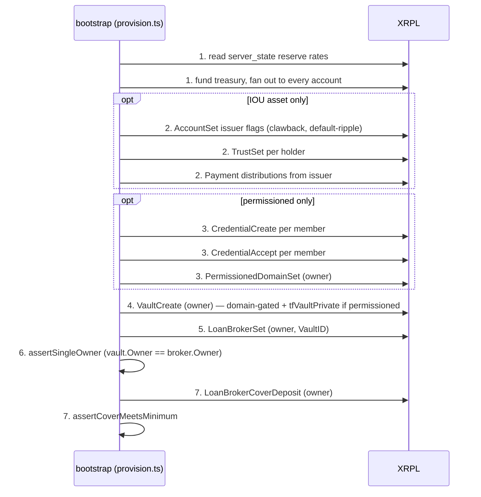

# Provisioning Sequence

`provision()` (`packages/bootstrap/src/provision.ts:45`) stands up a fully wired lending
environment from a single `Config`: derive accounts, fund them, create the protocol objects in
the order the [composition chain](../02-protocol/index.md) requires, and assert the invariants
that chain depends on. It is idempotent — re-running against the same seed and setup id skips
objects that already exist (`provision.ts:43-44`).

This page documents the concrete on-ledger object-creation order and how it branches by vault
mode. For the funding amounts themselves, see [Reserve Funding](./reserve-funding.md); for how the
fan-out and batch steps are actually submitted, see [Transaction Batching](./transaction-batching.md).

## The 7 steps

### 1. Derive accounts, read reserve rates, fund via treasury fan-out

`deriveAccountSet` builds the account pool (`provision.ts:50`). `readReserveRates` reads live
`reserve_base`/`reserve_inc` from `server_state` (`provision.ts:79`). `fundingPlan` computes the
drops each account needs (`provision.ts:81`, detailed below); a treasury sized to the total is
funded and then fanned out to every derived account (`provision.ts:82-84`):

```ts
// provision.ts:79-84
const reserveRates = await readReserveRates(client);
const everyAccount = allAccounts(accounts);
const dropsForAccount = fundingPlan(config, reserveRates);
const totalDrops = everyAccount.reduce((sum, a) => sum + dropsForAccount(a), 0);
const treasury = await fundTreasuryForTargets(client, everyAccount.length, totalDrops, log);
await fanOutFunding(client, treasury, everyAccount, { dropsForAccount, log });
```

### 2. Issuer flags, trust lines, distributions — IOU only

Skipped entirely for a native-XRP vault (`provision.ts:92`, `isXrpAsset(config.asset)` guard).
For an issued-token vault, three batches run in order: issuer flags (`issuerFlagSteps`), trust
lines for every holder (`trustSteps`), then distributions from the issuer (`distributeSteps`):

```ts
// provision.ts:92-104
if (!isXrpAsset(config.asset)) {
  // Batch 2: issuer flags (chained within the issuer's sequence).
  await runBatch(deps, issuerFlagSteps(deps));
  // Batch 3: trust lines (one per holder + owner, all different accounts).
  const holders = [accounts.owner, ...accounts.depositors, ...accounts.borrowers];
  await runBatch(deps, holders.flatMap((h) => trustSteps(deps, h.wallet, roleLabel(h))));
  // Batch 4: distributions (all from the issuer).
  await runBatch(deps, [
    ...distributeSteps(deps, accounts.owner.wallet, "owner", coverAndLiquidity(config)),
    ...accounts.depositors.flatMap((d) => distributeSteps(deps, d.wallet, `depositor[${d.index}]`, liquidityPerHolder(config))),
    ...accounts.borrowers.flatMap((b) => distributeSteps(deps, b.wallet, `borrower[${b.index}]`, liquidityPerHolder(config))),
  ]);
}
```

`issuerFlagSteps` (`steps.ts:82-96`) sets two `AccountSet` flags on the issuer: `asfAllowClawback`
(`ASF_ALLOW_CLAWBACK = 16`, `steps.ts:25`) and `asfDefaultRipple` (`ASF_DEFAULT_RIPPLE = 8`,
`steps.ts:24`). `trustSteps` (`steps.ts:98-107`) issues a `TrustSet` from each holder to the
issuer with a fixed `LimitAmount.value` of `"100000000"` (`steps.ts:105`); it returns `[]` for an
XRP asset (`steps.ts:99`). `distributeSteps` (`steps.ts:109-118`) sends a `Payment` of the issued
currency from the issuer to each holder; it likewise returns `[]` for XRP (`steps.ts:110`). The
owner receives `coverAndLiquidity(config)` — `config.coverAmount * 2` (`provision.ts:136-138`);
each depositor/borrower receives `liquidityPerHolder(config)` — `config.debtMaximum`
(`provision.ts:141-143`).

### 3. Credentials and domain — permissioned only

Skipped entirely for a public vault (`provision.ts:108`, `if (config.domain)` guard). For a
permissioned vault, credentials are created, then accepted, then the domain is created:

```ts
// provision.ts:108-112
if (config.domain) {
  await runBatch(deps, credentialCreateSteps(deps));
  await runBatch(deps, credentialAcceptSteps(deps));
  await createDomain(deps);
}
```

`credentialCreateSteps` (`steps.ts:134-142`) issues one `CredentialCreate` per depositor and
borrower from the credential issuer (`requireCredentialIssuer`, `steps.ts:128-132`), using the
first configured `acceptedCredentials[0].credentialType` (`requireCredentialType`,
`steps.ts:121-125`), hex-encoded via `encodeCredentialType`. `credentialAcceptSteps`
(`steps.ts:144-152`) has each member accept with a `CredentialAccept` naming the same issuer and
credential type. `createDomain` (`steps.ts:154-167`) then submits a single `PermissionedDomainSet`
from the owner naming that same issuer/credential-type pair in `AcceptedCredentials`, and records
the resulting `domainId` by looking the domain back up (`steps.ts:161-166`):

```ts
// steps.ts:154-167
export async function createDomain(deps: StepDeps): Promise<void> {
  const owner = deps.accounts.owner.wallet;
  const issuer = requireCredentialIssuer(deps);
  const credHex = encodeCredentialType(requireCredentialType(deps));

  await runBatch(deps, [{
    action: "domain-create",
    alreadyDone: async () => (await findDomainId(deps.client, owner.address)) !== undefined,
    build: () => ({ wallet: owner, tx: { TransactionType: "PermissionedDomainSet", Account: owner.address, AcceptedCredentials: [{ Credential: { Issuer: issuer.address, CredentialType: credHex } }] } }),
  }]);
  deps.env.objects.domainId = await findDomainId(deps.client, owner.address);
}
```

### 4. Create the vault

`createVault` (`steps.ts:169-197`) always runs, but its shape branches on whether step 3 set a
`domainId`:

```ts
// steps.ts:169-193
export async function createVault(deps: StepDeps): Promise<void> {
  const owner = deps.accounts.owner.wallet;
  const domainId = deps.env.objects.domainId;
  const permissioned = domainId !== undefined;

  const asset: Currency = isXrpAsset(deps.config.asset)
    ? { currency: "XRP" }
    : { currency: deps.config.asset.currency, issuer: deps.accounts.issuer.address };

  await runBatch(deps, [{
    action: "vault-create",
    alreadyDone: async () => (await findVault(deps.client, owner.address)) !== undefined,
    build: () => ({
      wallet: owner,
      tx: {
        TransactionType: "VaultCreate",
        Account: owner.address,
        Asset: asset,
        ...(permissioned ? { DomainID: domainId, Flags: VaultCreateFlags.tfVaultPrivate } : {}),
        WithdrawalPolicy: VaultWithdrawalPolicy.vaultStrategyFirstComeFirstServe,
      },
    }),
  }]);
  const vault = await findVault(deps.client, owner.address);
  deps.env.objects.vaultId = vault?.index;
  deps.env.objects.shareMptId = vault?.shareMptId;
}
```

`domainId !== undefined` is the sole permissioned/public switch (`steps.ts:174`): when set, the
vault is created with `DomainID` and `Flags: tfVaultPrivate`; when absent, neither field is sent
and the vault is open. `WithdrawalPolicy` is always
`VaultWithdrawalPolicy.vaultStrategyFirstComeFirstServe` (`steps.ts:190`), regardless of mode.

### 5. Create the broker

`createBroker` (`steps.ts:199-222`) always runs, and refuses to run before `vaultId` is set
(`steps.ts:202`):

```ts
// steps.ts:199-222 (excerpt)
if (!vaultId) throw new Error("cannot create a broker before the vault exists");
...
tx: {
  TransactionType: "LoanBrokerSet",
  Account: owner.address,
  VaultID: vaultId,
  ManagementFeeRate: deps.config.managementFeeRate,
  DebtMaximum: isXrpAsset(deps.config.asset) ? xrpToDrops(deps.config.debtMaximum) : deps.config.debtMaximum,
  CoverRateMinimum: deps.config.coverRateMinimum,
  CoverRateLiquidation: deps.config.coverRateLiquidation,
}
```

`DebtMaximum` is converted to drops for an XRP asset and left as a whole-token string otherwise
(`steps.ts:215`).

### 6. Assert single ownership

Immediately after both objects exist, `provision` calls `assertSingleOwner` before any cover is
deposited (`provision.ts:117`), which loads the owner's `vault` and `loan_broker` account objects
and throws `InvariantError` unless both exist and share the same `Owner`
(`assertions.ts:13-26`, cited in full on the [protocol composition](../02-protocol/index.md#3-vault--lending)
page).

### 7. Deposit cover, assert the cover floor

`depositCover` (`steps.ts:224-249`) always runs, and refuses to run before `brokerId` is set
(`steps.ts:227`). The amount is `config.coverAmount` converted to drops for XRP, or an issued
`{currency, issuer, value}` amount otherwise (`steps.ts:231-233`), submitted as a single
`LoanBrokerCoverDeposit`. It is idempotent on the configured amount: `alreadyDone` compares the
broker's current `CoverAvailable` (via `findBrokerCover`) against the required cover and skips if
already met (`steps.ts:239-246`). `provision` then calls `assertCoverMeetsMinimum`
(`provision.ts:120`) to confirm the deposited cover is on-ledger before returning.



## The three vault modes

The reference config drives three distinct provisioning paths through the same 7-step sequence.
The stale `bootstrap/README.md` documents only the first of these — it "describes only the
IOU/permissioned path" (`.docsource/code-map.md` stale-docs note 4); all three are load-bearing.

| Mode | Guard | Skips | Runs |
|---|---|---|---|
| IOU, permissioned | `!isXrpAsset(config.asset)` true, `config.domain` set | nothing | all 7 steps |
| XRP, permissioned | `!isXrpAsset(config.asset)` false, `config.domain` set | step 2 (no trust lines, no distributions — liquidity is native XRP already funded in step 1) | 1, 3, 4, 5, 6, 7 |
| Public (any asset, no domain) | `config.domain` undefined | step 3 (no credentials, no domain — `createVault` builds an open vault) | 1, (2 if IOU), 4, 5, 6, 7 |

> [!NOTE]
> The two guards are independent (`isXrpAsset(config.asset)` at `provision.ts:92`;
> `config.domain` at `provision.ts:108`), so in principle a public XRP vault skips both step 2
> and step 3, running only steps 1, 4, 5, 6, 7. The task brief's three named modes — IOU-permissioned,
> XRP-permissioned, and public — are the ones called out explicitly; the fourth combination (public
> XRP) follows the same two independent guards.

## Idempotency

Every step is a `PlannedStep` with an `alreadyDone()` check (`steps.ts:43-47`). `runBatch` runs
all checks in parallel first, records anything already present as `skipped` without submitting,
and batch-submits only what remains:

```ts
// steps.ts:52-78
export async function runBatch(deps: StepDeps, steps: PlannedStep[]): Promise<void> {
  if (steps.length === 0) return;
  const done = await Promise.all(steps.map((s) => s.alreadyDone()));
  const toRun: { step: PlannedStep; item: BatchItem }[] = [];
  steps.forEach((s, i) => {
    const corr = correlationId(deps.setupId, s.action);
    if (done[i]) {
      deps.log(`${s.action} — already present, skip`);
      const record: StepRecord = { action: s.action, correlationId: corr, result: "skipped", skipped: true };
      deps.env.steps.push(record);
      deps.onStep?.(record);
    } else {
      const { wallet, tx } = s.build();
      toRun.push({ step: s, item: { wallet, tx, ctx: { setupId: deps.setupId, correlationId: corr } } });
    }
  });
  if (toRun.length === 0) return;
  const submitted = await submitBatch(deps.client, toRun.map((r) => r.item));
  ...
}
```

Each per-step `alreadyDone` check reads the actual condition the step establishes rather than a
flag: `accountHasFlag` for issuer flags (`steps.ts:87,92`), `hasTrustLine` for trust lines
(`steps.ts:104`), an issued-balance comparison for distributions (`steps.ts:115`),
`hasAcceptedCredential` for both credential steps (`steps.ts:139,149`), `findDomainId` for the
domain (`steps.ts:163`), `findVault` for the vault (`steps.ts:182`), `findBrokerId` for the broker
(`steps.ts:206`), and a `findBrokerCover` comparison against the required amount for cover
(`steps.ts:242-246`). This is what makes re-running `provision()` against an existing environment
safe: it reuses accounts and skips every object that is already on ledger (`provision.ts:43-44`).

## Funding plan

`fundingPlan` (`provision.ts:153-173`) computes, per account, the reserve floor for the role it
will hold plus — for an XRP vault only — the liquidity that role additionally moves:

```ts
// provision.ts:153-173
function fundingPlan(config: Config, rates: ReserveRates): (account: DerivedAccount) => number {
  const shape: VaultShape = {
    isXrp: isXrpAsset(config.asset),
    permissioned: config.domain !== undefined,
    credentialedMembers: config.domain ? config.pool.depositors + config.pool.borrowers : 0,
  };
  const liquidityDrops = (value: string) => Number(decimalToScaled(value, 6));
  return (account) => {
    const reserve = roleReserveDrops(account.role, shape, rates);
    if (!shape.isXrp) return reserve; // IOU liquidity is minted, not funded
    switch (account.role) {
      case "owner":
        return reserve + liquidityDrops(coverAndLiquidity(config));
      case "depositor":
      case "borrower":
        return reserve + liquidityDrops(liquidityPerHolder(config));
      default:
        return reserve; // issuer and credential issuer own no liquidity in an XRP session
    }
  };
}
```

For an IOU vault the reserve floor (`roleReserveDrops`) is all any account is funded with — the
IOU liquidity itself is minted to holders in step 2, not funded in drops. For an XRP vault there
is no minting step, so each liquidity-holding role is additionally funded in drops for what it
moves: the owner for `coverAndLiquidity(config)` (double the configured cover amount,
`provision.ts:136-138`), each depositor/borrower for `liquidityPerHolder(config)`
(`config.debtMaximum`, `provision.ts:141-143`). The issuer and credential issuer hold no liquidity
in either mode and are funded only their reserve floor. See [Reserve Funding](./reserve-funding.md)
for how `roleReserveDrops` and `peakObjectCount` derive that floor from live `server_state` rates,
and [Transaction Batching](./transaction-batching.md) for how `fanOutFunding` and `runBatch`
actually submit these steps in batches rather than serially.

## Read next

- [Protocol composition](../02-protocol/index.md) — the four-amendment chain these steps implement
- [Reserve Funding](./reserve-funding.md) — the per-role reserve math behind `fundingPlan`
- [Transaction Batching](./transaction-batching.md) — how the fan-out and step batches are submitted
