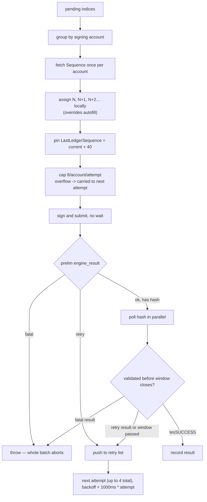

# Per-Ledger Transaction Batching

Provisioning uses two complementary batching mechanisms:

- **`submitBatch`** — a *soft* batcher (sections 1–5). It co-locates many transactions from the same account into one ledger by managing sequence numbers locally. Each transaction remains an independent on-ledger transaction; nothing is atomic across them. This is the workhorse for same-account fan-out (funding) and for the independent single-account steps (issuer flags, vault, broker, cover).
- **`submitNativeBatch`** — a *hard*, atomic batcher (section 6) built on the **XLS-56 Batch** amendment. It wraps a small set of transactions from *different* accounts into one `Batch` transaction that applies all-or-nothing. It is used only where cross-account steps must succeed together: the credential handshake and the trust+distribute pair.

Sections 1–5 describe the soft batcher; section 6 describes the native XLS-56 batcher and how provisioning routes each pair to it.

## 1. The problem

XRPL's baseline submission pattern — autofill, sign, `submitAndWait`, repeat — blocks on ledger close for every transaction. Provisioning a session means dozens of independent transactions (issuer flags, trust lines, distributions, credentials, domain, vault, broker, cover) across several distinct signing accounts. Submitted one at a time, that is dozens of ledger-close waits stacked serially — the dominant cost of provisioning is wall-clock time spent waiting, not transaction count.

The reviewer-facing question this answers: can the system get **multiple transactions from the same account into the same ledger**, and does it handle the two ways that goes wrong — a submission the ledger doesn't accept yet (queued, wrong sequence, fee moved) and a submission the ledger permanently rejects? `submitBatch` (`packages/shared/src/client.ts:113-190`) is the answer to both halves.

## 2. How submitBatch works

Signature and the constants that shape its behavior:

```ts
// The XRPL open-ledger per-account queue is ~10; stay under it with headroom.
const MAX_PER_ACCOUNT_PER_LEDGER = 8;

export async function submitBatch(client: Client, items: BatchItem[]): Promise<SubmitResult[]> {
  if (items.length === 0) return [];
  const results = new Array<SubmitResult | undefined>(items.length);
  const MAX_ATTEMPTS = 4;
  ...
```
(`client.ts:111-116`)

Each `BatchItem` is `{ wallet, tx, ctx }` (`client.ts:98-102`) — an unsigned transaction plus the wallet that signs it and the `{setupId, correlationId}` memo context. `submitBatch` runs up to `MAX_ATTEMPTS = 4` outer attempts; each attempt re-groups whatever is still pending:

```ts
let pending = items.map((_, i) => i);
for (let attempt = 0; attempt < MAX_ATTEMPTS && pending.length > 0; attempt++) {
  const currentLedger = ((await client.request({ command: "ledger_current" })).result as { ledger_current_index: number }).ledger_current_index;

  // Group pending indices by signing account.
  const byAccount = new Map<string, number[]>();
  for (const i of pending) {
    const addr = items[i]!.wallet.address;
    (byAccount.get(addr) ?? byAccount.set(addr, []).get(addr)!).push(i);
  }
```
(`client.ts:119-128`)

### Sequence assignment

For each account, the current `Sequence` is fetched **once per attempt** — not once per transaction — and assigned locally, incrementing per item:

```ts
for (const [addr, indices] of byAccount) {
  const info = await client.request({ command: "account_info", account: addr, ledger_index: "current" });
  let seq = Number(info.result.account_data.Sequence);
  const thisLedger = indices.slice(0, MAX_PER_ACCOUNT_PER_LEDGER);
  const overflow = indices.slice(MAX_PER_ACCOUNT_PER_LEDGER);
  carriedOver.push(...overflow);
  for (const i of thisLedger) {
    const { wallet, tx, ctx } = items[i]!;
    const tagged = { ...tx, Memos: [...] } as SubmittableTransaction;
    const filled = await client.autofill(tagged);
    filled.Sequence = seq++; // intentionally overrides autofill — client-managed sequence is the whole point of batching
    filled.LastLedgerSequence = currentLedger + 40; // intentionally overrides autofill — pin all batch txns to the same ledger window
    const signed = wallet.sign(filled);
    prepared.push({ index: i, blob: signed.tx_blob, hash: signed.hash });
  }
}
```
(`client.ts:134-152`)

`client.autofill` would fetch the *same* current sequence for every transaction on an account if called independently per item — the whole account's queue would collide on one sequence number. `submitBatch` calls `autofill` for fee/network fields, then overwrites `Sequence` with a locally incremented counter (`N`, `N+1`, `N+2`, …) so each of an account's transactions gets a distinct, consecutive sequence in one pass (`client.ts:147`). Every transaction in the attempt — regardless of account — is also pinned to the same ledger window via `LastLedgerSequence = currentLedger + 40` (`client.ts:148`), so the batch has one shared expiry to reason about.

> [!NOTE]
> `MAX_PER_ACCOUNT_PER_LEDGER = 8` caps how many of one account's pending items are prepared in a single attempt, with the stated rationale in-code: *"The XRPL open-ledger per-account queue is ~10; stay under it with headroom"* (`client.ts:110-111`). This is the codebase's own operating assumption about the open-ledger queue, not a cited protocol constant — treat it as an engineering safety margin, not a spec value.

Anything past the 8-per-account cap for that attempt is **overflow**, not an error — it is pushed onto `carriedOver` and retried as part of the batch's normal retry list next attempt (`client.ts:133,138-139,157`).

### Submit without waiting, then poll in parallel

Every prepared transaction in the attempt is submitted with a bare `submit` (no wait), and only the synchronous engine-apply result is classified immediately:

```ts
const toPoll: { index: number; hash: string }[] = [];
const retry: number[] = [...carriedOver];
for (const p of prepared) {
  const res = await client.request({ command: "submit", tx_blob: p.blob });
  const prelim = (res.result as { engine_result: string }).engine_result;
  const bucket = classifyResult(prelim);
  if (bucket === "fatal") {
    throw new Error(`${items[p.index]!.tx.TransactionType} (${items[p.index]!.ctx.correlationId}) submit returned ${prelim}`);
  }
  if (bucket === "retry") retry.push(p.index);
  else toPoll.push({ index: p.index, hash: p.hash });
}

// Poll accepted hashes in parallel for validation.
await Promise.all(toPoll.map(async ({ index, hash }) => {
  const validated = await pollValidated(client, hash, currentLedger + 40);
  if (!validated) { retry.push(index); return; }
  const bucket = classifyResult(validated.engineResult);
  if (bucket === "fatal") {
    throw new Error(`${items[index]!.tx.TransactionType} (${items[index]!.ctx.correlationId}) returned ${validated.engineResult}`);
  }
  if (bucket === "retry") retry.push(index);
  else results[index] = validated;
}));
```
(`client.ts:154-179`)

This is the mechanism that gets multiple transactions from one account into one ledger close: none of the `Promise.all`-polled hashes blocks another from being submitted, because submission already finished before polling starts. `pollValidated` polls a single hash on a 1-second cadence until it validates or the ledger passes its `LastLedgerSequence` window, at which point it returns `undefined` (retryable, not fatal) rather than throwing (`client.ts:194-210`).

Between attempts, whatever landed in `retry` (overflow plus transient failures) becomes the next attempt's `pending`, with a linear backoff:

```ts
pending = retry;
if (pending.length > 0) await new Promise((r) => setTimeout(r, 1000 * (attempt + 1)));
```
(`client.ts:181-182`)

If anything is still pending after `MAX_ATTEMPTS`, the whole batch throws, naming the stuck correlation IDs (`client.ts:185-188`). Results are returned in the original input order regardless of which attempt or poll settled each one (`client.ts:189`, indexed writes into `results[index]` throughout).

## 3. Error handling — classifyResult

`submitBatch` treats every engine result as one of three buckets, decided by `classifyResult` (`client.ts:85-96`):

```ts
export function classifyResult(engineResult: string): "ok" | "retry" | "fatal" {
  if (engineResult === "tesSUCCESS") return "ok";
  // Transient: queued behind another tx, sequence not yet current, fee risen, or open-ledger
  // per-account queue overflow (tel* codes) — all resolve once the ledger drains or advances.
  if ([
    "terQUEUED", "terPRE_SEQ", "tefPAST_SEQ", "tecINSUFFICIENT_FEE",
    "telCAN_NOT_QUEUE", "telCAN_NOT_QUEUE_ANY", "telCAN_NOT_QUEUE_FULL",
    "telCAN_NOT_QUEUE_BLENDED", "telCAN_NOT_QUEUE_BLOCKED",
  ].includes(engineResult)) return "retry";
  // Everything else — tem* (malformed), other tef*, other tec* — is permanent for a provisioning tx.
  return "fatal";
}
```

| Bucket | Codes | Meaning here |
|---|---|---|
| `ok` | `tesSUCCESS` | Applied and validated. Result recorded, index done. |
| `retry` | `terQUEUED`, `terPRE_SEQ`, `tefPAST_SEQ`, `tecINSUFFICIENT_FEE`, `telCAN_NOT_QUEUE*` (5 variants) | Transient — a sequence gap or reused sequence, or open-ledger queue backpressure. Re-queued into `pending` for the next attempt, where sequences are re-fetched fresh. |
| `fatal` | Anything else — `tem*`, other `tef*`, other `tec*` | Permanent for a provisioning transaction. Throws immediately and aborts the **entire batch**, not just the one item. |

The fatal-throws-everything design is deliberate, per the function's own comment: *"Provisioning transactions are expected to succeed, so anything permanent is fatal; only genuinely transient results are retried"* (`client.ts:83-84`). Provisioning is not a best-effort fan-out — a genuine rejection (malformed transaction, insufficient funds, wrong auth) means the environment is in an invalid state and the caller needs to know immediately rather than have the batch silently continue around the failure.

For the full result-code catalog (`tes`/`tec`/`tem` families and HTTP-status mapping for the action API), see [Result Codes](../07-reference/result-codes.md#1-on-ledger-result-codes) — that page's ["ter" retryable section](../07-reference/result-codes.md) covers the same `classifyResult` buckets from the result-code side.

## 4. Flow of one attempt



## 5. Where it is used

| Caller | Purpose | Source |
|---|---|---|
| `runBatch` | Provisioning fan-out for **independent, single-account** step groups: issuer flags, and the strictly-sequential vault → broker → cover chain, after filtering out steps already on-ledger. The credential and trust+distribute pairs are no longer submitted here — they go through `runCrossAccountBatches` (section 6). | `packages/bootstrap/src/steps.ts:52-78`, calling `submitBatch` at `steps.ts:69` |
| `fanOutFunding` | Funding fan-out: batches the treasury `Payment`s to every account still short of its target balance, wrapped in `withRetry` for network-level transience. | `packages/shared/src/funding.ts:27-64`, calling `submitBatch` at `funding.ts:54` |
| `addParticipant` | Runtime add-participant: seats a new depositor/borrower into a running session, batching that member's steps through the `runBatch` path. (This path still uses the soft batcher — it is signed at runtime and not yet migrated to the atomic native Batch.) | `packages/session/src/add-participant.ts:92-97` (calls `runBatch`, which calls `submitBatch`) |

These share one property: the caller already knows every transaction it needs before submitting any of them, which is exactly the shape `submitBatch` is built for — a known, finite set of transactions across a known set of accounts, submitted for the minimum number of ledger closes.

## 6. Native XLS-56 Batch — atomic cross-account pairs

The soft batcher gets many of one account's transactions into a ledger, but each is still independent: if a member's `CredentialCreate` lands and its `CredentialAccept` fails, the member is left half-provisioned. Two provisioning steps are genuinely *one unit of work across two accounts*:

- **The credential handshake** — `CredentialCreate` (signed by the credential issuer) + `CredentialAccept` (signed by the holder). The accept depends on the create.
- **Trust + distribute** — `TrustSet` (signed by the holder) + the issuer's distribution `Payment`. The distribution depends on the trust line existing.

Each pair is submitted as a single **XLS-56 `Batch`** transaction with the `tfAllOrNothing` flag, so either both inner transactions apply or neither does — no half-provisioned state, and the create→accept / trust→distribute ordering hazard disappears.

### submitNativeBatch

`submitNativeBatch(client, inners)` (`packages/shared/src/client.ts:213`) builds one `Batch` from 2–8 inner transactions, each with its signing wallet (`BatchInner`, `client.ts:198`):

1. **Mark each inner.** Every inner transaction gets the `tfInnerBatchTxn` flag (`0x40000000`, `client.ts:211,227`) and its memo tags. It does **not** set `Sequence`, `Fee`, or `SigningPubKey` — `client.autofill` fills those for the batch and rejects non-conforming presets, and inner transactions must carry `Fee: "0"` and an empty `SigningPubKey`.
2. **Build the outer.** One `Batch` with `Flags: BatchFlags.tfAllOrNothing` and the inners under `RawTransactions`. `autofill` computes inner sequences and the outer fee.
3. **Sign per account.** `autofill`'s outer fee counts the base and inner fees but not the `BatchSigners`, so one base fee is added per distinct account **minus the submitter** — `accounts.size - 1`, because `combineBatchSigners` drops the submitter's own `BatchSigner` (the submitter signs the outer directly). Omitting this returns `telINSUF_FEE_P`.
4. **Combine and submit.** Each distinct account signs a *separate copy* of the batch via `signMultiBatch` (which overwrites `BatchSigners` in place, so a copy per account is required), the copies are merged with `combineBatchSigners`, the submitting account signs the outer, and it is submitted with `submitAndWait`.

The outer result is classified with the same `classifyResult` buckets as the soft batcher: a `fatal` result throws (naming the correlation IDs), and a transient one — including `telINSUF_FEE_P`, treated as retryable so a fee spike self-heals — retries with fresh sequences up to four attempts.

### runCrossAccountBatches

`runCrossAccountBatches(deps, units)` (`packages/bootstrap/src/steps.ts:96`) is the provisioning-side driver. A `BatchUnit` (`steps.ts:82`) bundles one holder's paired inners plus an `alreadyDone`/`verify` pair of on-ledger checks. The driver:

1. Runs each unit's `alreadyDone()` and **skips** units already satisfied on-ledger — recording their inners as `skipped` with the same `StepRecord`/`onStep`/log bookkeeping as `runBatch`, so re-runs are idempotent.
2. **Chunks** the remaining units so no `Batch` exceeds 8 inner transactions (`steps.ts:122`) — four two-inner pairs per batch — and submits each chunk via `submitNativeBatch`.
3. After a chunk's outer validates, calls each unit's `verify()` as the on-ledger source of truth, records every verified unit's `StepRecord`, and only then throws if any unit failed to verify — so a spurious verification failure never erases the audit trail of pairs that actually landed (`steps.ts:144`).

Idempotency keys off the ledger, not a flag: credentials skip on `hasAcceptedCredential`; trust+distribute skips when the holder already holds at least the target issued balance (which implies the trust line exists).

### Where the pairs are wired

| Pair | Builder | Provisioning call |
|---|---|---|
| Credential create + accept (permissioned vaults) | `credentialHandshakeUnits` (`steps.ts:254`) | `provision.ts:104`, gated by `if (config.domain)` |
| Trust + distribute (IOU vaults, incl. owner) | `trustAndDistributeUnits` (`steps.ts:211`) | `provision.ts:98`, gated by `if (!isXrpAsset(config.asset))` |

A public vault has no credentials and a native-XRP vault has no trust/distribute, so those paths run no cross-account batches at all — the native batcher is engaged only where an atomic cross-account pair actually exists. The strictly-sequential vault → broker → cover chain is **not** batched: each step needs a ledger-object ID produced by the previous one, which an inner batch transaction cannot reference.

> [!NOTE]
> XLS-56 Batch requires the `BatchV1_1` amendment (active on Devnet) and an `xrpl` client that implements its signing preimage. See [Environment Variables](../07-reference/environment-variables.md) and [Running the Engine](../05-guides/running-the-engine.md) for the client version this pins.

See [Provisioning Sequence](./provisioning-sequence.md) for how these batched step groups compose into the full provisioning order, and [Result Codes](../07-reference/result-codes.md) for the on-ledger code catalog referenced above.
